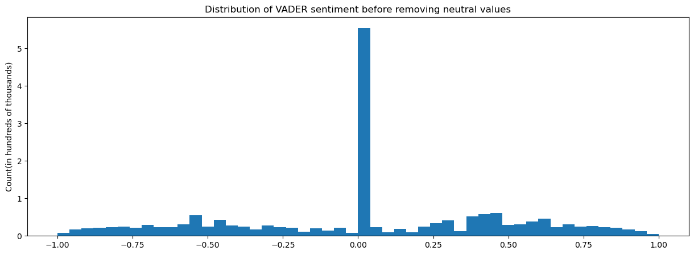

# POLITICAL SENTIMENT ANALYSIS
*Angelo Turri*
_
*angelo.turri@gmail.com*

## Stakeholder & Problem
The stakeholder is a social media communications team working for a political candidate, Donald Trump. They have requested that you analyze a body of social media posts from their voter base and extract meaningful insights on their base's attitudes.

## Data Origin & Description

All steps taken in this section were performed in [the "data_prep" notebook](https://github.com/Jellohub/political_sentiment_analysis/blob/master/notebooks/data_prep.ipynb).

### Data: Origin
Data is taken from the former reddit titled ***r/the_donald***. This reddit has been archived along with 20,000 others on [the-eye.eu](https://the-eye.eu/redarcs/). If you want to download it yourself, you just need to type "the_donald" in the search bar on this website and download the "Comments" link provided there. [The "data_prep" notebook](notebooks/data_prep.ipynb) uses the following URL to download (if you click it, the file will start downloading on your computer):

- https://the-eye.eu/redarcs/files/The_Donald_comments.zst

Fair warning - if you are about to explore on this website, be cautious. I looked at some of the archived reddits and will never be the same again.

### Data: Statistics
The compressed file is sizeable at 3.8GB, but this is in .zst format. Once converted to a .txt file, it takes up a whopping 37.48 GB of space, containing data on approximately 48 million posts. Due to the sheer amount of data and the limitations of my machine, I was unwilling to analyze all 48 million posts. I wanted to take 2 million posts, so I kept every 23rd post from this file.

Each post is recorded as a dictionary. Only some of the keys were relevant to our analysis:
- Raw text
- Post score (upvotes - downvotes)
- Author
- Date posted

After extraction, our initial dataframe had 2.1 million total entries ranging from August of 2015 to April of 2020, for a total of 1710 days – approximately 4.5 years. There are 178,308 unique authors.

## Preprocessing

All steps taken in this section were performed in [the preprocessing notebook](https://github.com/Jellohub/political_sentiment_analysis/blob/master/notebooks/preprocessing.ipynb).

- Removing hyperlinks and extraneous characters
- Tokenizing posts (separating posts into lists, where each element is an individual word)
- Stopword removal (stopwords = commonly used words with little meaning that contribute almost nothing to models)
- Calculating post lengths
- Creating bigrams (two-word phrases) and trigrams (three-word phrases) to analyze reddit data at multiple levels of complexity
- Removing bot posts
- Capping post length at 200 words
- Giving post score a hard boundary of (-25,100)
- Spam removal (any post with numerous consecutive identical words/phrases)

# Feature Enginnering

Technically, we did minor feature engineering in [the preprocessing notebook](https://github.com/Jellohub/political_sentiment_analysis/blob/master/notebooks/preprocessing.ipynb) with bigrams and trigrams. All major feature engineering occurs in [the feature engineering notebook](notebooks/Technically, we did minor feature engineering in [the preprocessing notebook](https://github.com/Jellohub/political_sentiment_analysis/blob/master/notebooks/preprocessing.ipynb) with bigrams and trigrams. All major feature engineering occurs in [the feature engineering notebook](notebooks/https://github.com/Jellohub/political_sentiment_analysis/blob/master/notebooks/feature_engineering.ipynb).
).

### Sentiment analysis

Sentiment analysis was done with VADER (Valence Aware Dictionary sEntiment Reasoner). I discovered VADER through [this video by Rob Mulla](https://www.youtube.com/watch?v=QpzMWQvxXWk). Vader uses [a lexicon of about 7,500 words](https://github.com/cjhutto/vaderSentiment/blob/master/vaderSentiment/vader_lexicon.txt) to calculate the probability of a piece of text being postive, negative or neutral. It also gives a compound score of sentiment based on these three probabilities, which is what we use to score sentiment.

[Neptune.ai](https://neptune.ai/blog/sentiment-analysis-python-textblob-vs-vader-vs-flair#:~:text=Valence%20aware%20dictionary%20for%20sentiment,to%20calculate%20the%20text%20sentiment.&text=Positive%2C%20negative%2C%20and%20neutral.) describes VADER as being "optimized for social media data and can yield good results when used with data from twitter, facebook, etc." Since Reddit counts as social media, I believe VADER is a good choice for this project.

### Bag of words features

We have both of the target variables we need - score and sentiment. We are unable to use models meaningfully on our data as it currently stands. To create proper training data:

- I limited my vocabulary to the top 100 unigrams, bigrams, and trigrams. This was necessary because keeping all the words would have resulted in too many features.
- For each word/phrase in our vocabulary, I went through each post and determined whether the word/phrase was present.
- The result was three sparse matrices for unigrams, bigrams and trigrams.
- Due to limiting our vocabulary, many of the rows in these sparse matrices consisted entirely of 0's (that is, none of the words in our vocabulary were present in the given post). These rows do nothing but dilute the data and impeded the model's ability to make predictions, so all these rows were removed.

## Metrics
I use the MAE (Mean Absolute Error), which averages the number of times someone made an error.
I also use the Rsquared; the R-squared value tells you much of the actual values' variance a model can explain by using its odwn model.

# Modeling

All modeling was done in [the modeling notebook](https://github.com/Jellohub/political_sentiment_analysis/blob/master/notebooks/modeling.ipynb). I only include the best models and their results in the final notebook.

The model of choice was Linear Regression. The advantages of this model for this project are:

- It provides coefficients for all independent variables, making it interpretable;
- The coefficients can be positive or negative, so we know whether the independent variable positively or negatively impacted the target

We fit one model for each set of features, so we could analyze the model coaefficients separately for single-, two-, and three-word phrases.

### First Iteration

We started by using the "score" target variable. The results were very poor, with R-squared values of <0.1 for each model. These are so abysmal that I am not going to go into details for any of these models.

|             | Second iteration | Third iteration | Fourth iteration |
|-------------|------------------|-----------------|------------------|
| Unigram R2  | 0.245            | 0.249           | 0.249            |
| Bigram R2   | 0.166            | 0.168           | 0.168            |
| Trigram R2  | 0.326            | 0.344           | 0.333            |
| Unigram MAE | 0.33             | 0.408           | 0.408            |
| Bigram MAE  | 0.433            | 0.468           | 0.469            |
| Trigram MAE | 0.363            | 0.406           | 0.424            |

## Methods Justification & Value to Stakeholder

The Linear Regression that we use provides a series of positive and negative coefficients that say how well they are able to control / dominate territory.
    
## Limitations

We only use one social media platform: Reddit.
Furthermore, we only use one subreddit.
So I would say our data could be considered limited in scope.

## Top Words & Phrases

## Recommendations

- Cater to the base’s religious tendencies. “God” appears in the most positive words and phrases – “God bless,” “Thank God,” “God bless America.”
- Speak fondly of the US, since the base holds it in high regard. “America great”, “United States”, “God bless America,” “make America great,” and “making America great” appear in the positive columns.

## Repository Structure
- **[data](https://github.com/Jellohub/political_sentiment_analysis/tree/master/data)**: folder containing data files, if any.
    - [**training_data**](https://github.com/Jellohub/political_sentiment_analysis/tree/master/data/training_data): the target variables and features required for the linear regression models.
- **[notebooks](https://github.com/Jellohub/political_sentiment_analysis/tree/master/notebooks)**: folder containing all four secondary notebooks. These are only there for anyone who wants technical details.
- **[visualizations](https://github.com/Jellohub/political_sentiment_analysis/tree/master/visualizations)**: folder containing all visualizations used in the presentation and README.
- **[final notebook](https://github.com/Jellohub/political_sentiment_analysis/blob/master/final_notebook.ipynb)**: project notebook containing all data imports, preprocessing, feature engineering, models, and visualizations.
- **[final_notebook.pdf](https://github.com/Jellohub/political_sentiment_analysis/blob/master/final_notebook.pdf)**: the pdf version of the final notebook
- **[presentation.pdf](https://github.com/Jellohub/political_sentiment_analysis/blob/master/presentation.pdf)**: pdf file with all presentation slides.